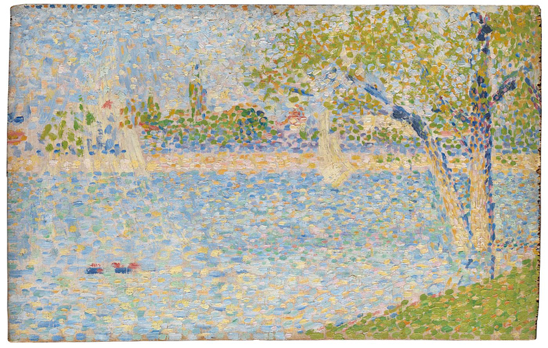
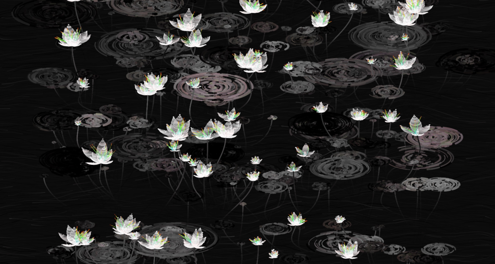

# zwan0192_TUT2_Quiz_8

## Imaging Technique Inspiration

I am inspired by the pointillism technique, particularly as seen in Georges Seurat's "A Sunday Afternoon on the Island of La Grande Jatte".

And "The Seine seen from La Grande Jatte".

I'd incorporate pointillism's stippling effect to digitally reinterpret a masterpiece in p5.js. This method translates well to pixels, making it ideal for demonstrating the basics of digital image construction. It allows for creative user interaction, as viewers can alter the dot density or colors, actively exploring the juxtaposition of individual elements and their collective visual harmony, embodying the assignment's goal of creative presentation through coding.

## Coding Technique Exploration

